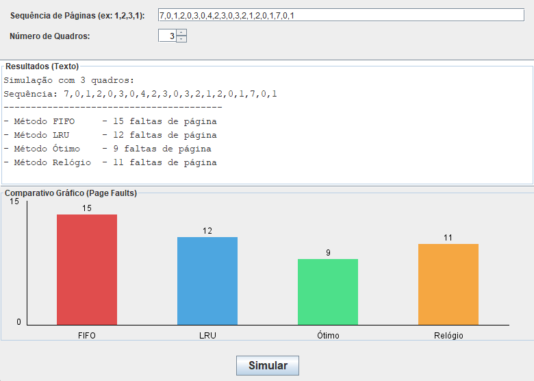

# UNIVERSIDADE DE FORTALEZA
### CENTRO DE CIÊNCIAS TECNOLÓGICAS
### CURSO: CIÊNCIA DA COMPUTAÇÃO

---

# SIMULADOR DE ALGORITMOS DE SUBSTITUIÇÃO DE PÁGINAS

**Autor:** Gabriel Levi do Nascimento Costa

**Palavras-chave:** Gerenciamento de Memória. Substituição de Páginas. Sistemas Operacionais. Simulador. Desempenho.

## Resumo

Este trabalho propõe o desenvolvimento de um simulador para avaliar o desempenho de diferentes algoritmos de substituição de páginas em sistemas de gerenciamento de memória virtual. Os algoritmos estudados incluem FIFO, LRU, Relógio, Ótimo, NFU e de Envelhecimento. A implementação prática foca nos quatro algoritmos principais (FIFO, LRU, Relógio e Ótimo), permitindo uma comparação direta de suas taxas de page fault através de uma aplicação interativa.

## Introdução

O gerenciamento eficiente da memória virtual é crucial para o desempenho dos sistemas operacionais. A alocação e substituição de páginas são tarefas complexas que afetam diretamente a experiência do usuário. Neste contexto, os algoritmos de substituição de páginas desempenham um papel fundamental na otimização do uso da memória. Este trabalho descreve a concepção e implementação de um simulador visual para analisar e comparar o desempenho dos algoritmos FIFO, LRU, Relógio e Ótimo, demonstrando como cada um lida com uma sequência de referências de páginas.

## Metodologia

O simulador foi desenvolvido na linguagem de programação Java, conforme especificado nos requisitos do projeto. A arquitetura do software foi estruturada em pacotes (gui e algorithms), separando a lógica da interface. Foi definida uma interface `IPageReplacementAlgorithm` para garantir que cada algoritmo (FIFO, LRU, Ótimo, Relógio) seguisse o mesmo contrato, facilitando a manutenção e extensibilidade.

Para a interface gráfica, foi utilizada a biblioteca Java Swing. A interface permite que o usuário insira dinamicamente uma sequência de referências de páginas (números inteiros separados por vírgula ou espaço) e defina o número de quadros de memória disponíveis. Ao acionar a simulação, o programa executa todos os algoritmos com os mesmos dados de entrada e exibe os resultados em duas áreas: uma área de texto com a contagem de faltas de página e um gráfico de barras comparativo para análise visual imediata.

## Resultados e Discussão

Para a validação do simulador, foram executados testes utilizando diferentes sequências de referência e números de quadros. Um dos testes principais utilizou a sequência de referência `7,0,1,2,0,3,0,4,2,3,0,3,2,1,2,0,1,7,0,1` e um total de 3 quadros de memória.

Os resultados quantitativos de faltas de página obtidos foram os seguintes:

Simulação com 3 quadros: Sequência: 7,0,1,2,0,3,0,4,2,3,0,3,2,1,2,0,1,7,0,1

    Método FIFO - 15 faltas de página

    Método LRU - 12 faltas de página

    Método Ótimo - 9 faltas de página

    Método Relógio - 11 faltas de página

Abaixo, o gráfico de barras gerado pela aplicação Swing para esta simulação:


---

A partir dos dados, observa-se que o algoritmo Ótimo, que serve como benchmark ideal, obteve o menor número de faltas (9), pois sempre remove a página que será usada mais tarde no futuro. O algoritmo FIFO apresentou o pior desempenho (15), o que é esperado devido à sua simplicidade. Os algoritmos LRU e Relógio apresentaram um desempenho extremamente próximos (12 e 11, respectivamente), demonstrando a eficácia do Relógio como uma aproximação eficiente do LRU sem o mesmo custo de implementação.

## Conclusão

O simulador desenvolvido cumpriu todos os objetivos propostos, fornecendo insights claros sobre o desempenho relativo dos diferentes algoritmos de substituição de páginas. A implementação em Java com Swing se mostrou eficaz, criando uma ferramenta educacional interativa. Com base nos resultados obtidos, foi possível avaliar quantitativamente quais algoritmos (como LRU e Relógio) são mais adequados para otimizar o uso da memória virtual em comparação com abordagens mais simples como o FIFO. O projeto permitiu solidificar o conhecimento teórico sobre gerenciamento de memória em sistemas operacionais.

## Referências

TANENBAUM, Andrew S.; BOS, Herbert. **Sistemas Operacionais Modernos**. 4. ed. São Paulo: Pearson Prentice Hall, 2016.

---

# 🚀 Como Executar o Projeto

Para compilar e executar o projeto, você precisará ter o **JDK (Java Development Kit)** instalado em sua máquina.

### 1. Estrutura de Pastas
```
src/
├── Algorithms/         # Pacote com a lógica dos algoritmos
│   ├── Clock.java
│   ├── Fifo.java
│   ├── Lru.java
│   └── Optimal.java
│
├── GUI/                # Pacote com os componentes da interface gráfica
│   ├── ChartPanel.java       (Responsável por desenhar o gráfico de barras)
│   ├── SimulationResult.java (Classe para armazenar os resultados)
│   └── SimulatorGUI.java     (A janela principal da aplicação)
│
├── Util/
│   └── IPageReplacementAlgorithm.java  (Interface que todos os algoritmos implementam)
│
└── Main.java           # Classe principal que inicia a aplicação
```
### 2. Compilação (via Terminal)

Abra um terminal na pasta raiz do projeto (a pasta que contém a pasta src). Execute o seguinte comando:

**Windows (com encoding UTF-8):**
```bash
javac -encoding UTF-8 -d . src/Main.java src/Algorithms/*.java src/GUI/*.java src/Util/*.java
macOS ou Linux:
Bash

javac -d . src/Main.java src/Algorithms/*.java src/GUI/*.java src/Util/*.java

3. Execução

Após a compilação bem-sucedida (nenhum erro deve aparecer), execute a classe principal (Main):
Bash

java Main

A interface gráfica do simulador será iniciada.